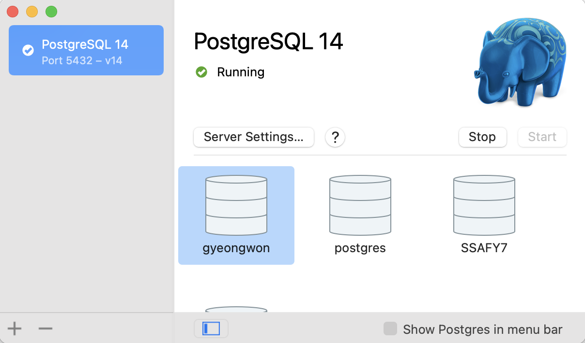
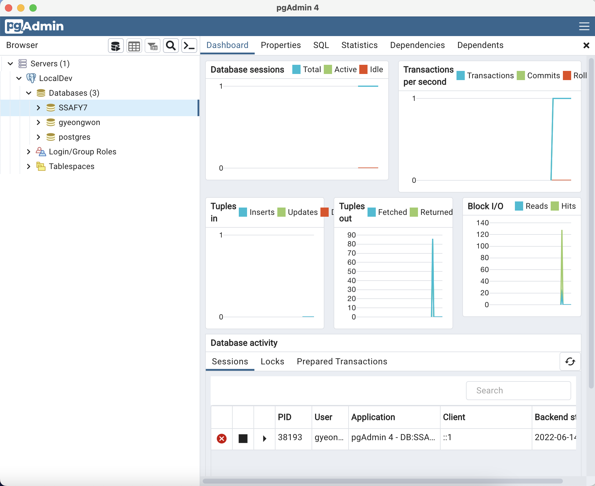

# PostgreSQL TIL

## 학습 중 특이점

맥북을 사용하고 있어서 초반 셋팅에 시간이 조금 걸렸다. 맥북의 경우, 다양한 방법으로 PostgreSQL을 사용할 수 있는데 그 중 가장 대표적인 것이 app을 설치하는 것과 brew로 설치하는 것이다. 그 중에서 나는 app을 설치하는 것을 선택했다.

app은 [app 공식 사이트](https://postgresapp.com/)에서 설치 가능하고 설치 및 실행 후 Initialize하면 new server를 만들 수 있다. Start/Stop 버튼을 통해 서버를 켜고 끌 수 있다. 

그런데 app으로는 GUI로 DB를 조작할 수 없었다. 터미널이 계속 켜져서 의아했는데 GUI 프로그램인 [pgAdmin](https://www.pgadmin.org/)을 설치해야 했다. 프로그램을 설치한 후에는 명세에 나온 것과 같이 GUI 프로그램 상에서 DB를 조작할 수 있었다. 

프로그램을 활용해 쿼리, 시퀀스, 컬럼 등 다양한 개념을 직접 편리하게 실습해볼 수 있었다

## 느낀 점

1학기 최종 프로젝트에서 (프론트엔드도 했지만) 백엔드도 주도적으로 맡아서 개발했었지만, 당시에는 기존 프로젝트에서 많은 힌트를 얻을 수 있어서 SQL이나 ORM을 활용할 일이 거의 없었는데 직접 DB를 조작하며 백엔드의 역할을 조금 더 이해할 수 있었다. 

공통 프로젝트에서는 프론트엔드 역할을 맡게 되었지만 추후 특화나 자율 프로젝트에서 백엔드를 맡게 되더라도, 혹은 프론트엔드 역할을 수행하며 백엔드을 담당하는 팀원에게 협업 요청을 하게 된다면 조금 더 서버에 대한 높은 이해를 가지고 요청할 수 있을 것이라고 생각한다.